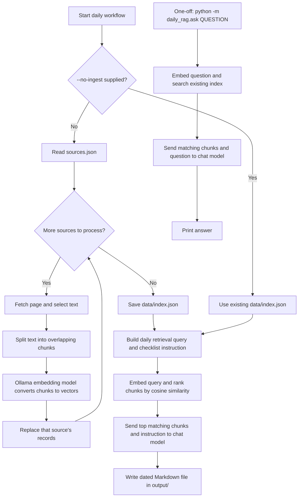

# daily-rag

`daily-rag` is a small command-line RAG (retrieval-augmented generation) application. It downloads text from a list of web pages, stores text chunks and their embeddings locally, finds chunks related to a question, and asks a local Ollama language model to answer using those chunks.

The included daily workflow turns the retrieved information into a Markdown to-do list in `output/`. The application does not send these model requests to a hosted API: it uses the Ollama service running on your machine.

## How The Pieces Fit

There are two workflows:

- `daily_rag.daily` refreshes the sources, asks for a daily list, and writes `output/YYYY-MM-DD.md`.
- `daily_rag.ask` asks a one-off question against the index that already exists. It does not refresh the sources first.

The pipeline is:



### Daily run, step by step

1. Unless `--no-ingest` is present, `daily_rag.daily` calls `ingest()`.
2. Ingestion reads `sources.json`, then fetches each URL. If a source has a CSS `selector`, only matching page elements are extracted; otherwise the page body is used. Common non-content elements such as scripts, navigation, and footers are removed.
3. The text is split into overlapping character-based chunks. The embedding model turns every chunk into a numeric vector that represents its meaning.
4. Each chunk, vector, source URL, and fetch time is saved in `data/index.json`. Existing records for a successfully fetched URL are replaced. If fetching or embedding one source fails, that source is skipped and ingestion continues; existing records for that URL are left in place.
5. The daily workflow builds a retrieval query from `PROFILE`, and a separate instruction asking for a prioritized Markdown checklist.
6. The query is embedded. The app compares its vector with every stored chunk using cosine similarity and selects the `TOP_K` closest chunks.
7. The chat model receives the profile, the selected text with source URLs, and the checklist instruction. It is told to use only that context and cite source URLs.
8. The result is written to `output/<today>.md` and printed in the terminal. Running it again on the same date replaces that date's output file.

The one-off `ask` workflow skips steps 1–4 and uses the existing index. Its question is used both to find relevant chunks and as the instruction for the chat model.

## Setup And Run

Run these commands from the repository root (`daily-rag/`), because source, index, and output paths are relative to the current working directory.

1. Install Python 3.10 or newer.
2. Install and start [Ollama](https://ollama.com/), then download the models configured in `daily_rag/config.py`:

   ```sh
   ollama pull llama3.2
   ollama pull nomic-embed-text
   ```

   Keep the Ollama service running while using the application.
3. Create and activate a virtual environment, then install this project's Python dependencies:

   ```sh
   python3 -m venv .venv
   source .venv/bin/activate
   python -m pip install -e .
   ```

4. Generate a daily digest (this fetches the configured sources first):

   ```sh
   python -m daily_rag.daily
   ```

5. Ask a one-off question against the saved index:

   ```sh
   python -m daily_rag.ask "What AI tooling news should I look into?"
   ```

Useful variations:

```sh
python -m daily_rag.ingest                 # Refresh the index without generating a digest
python -m daily_rag.daily --no-ingest      # Generate from the current index without fetching pages
```

The first ingestion creates `data/index.json`. `output/` is created automatically when the daily workflow writes its result.

## Change What It Reads

Edit `sources.json`. Each entry needs a URL and may include a CSS selector:

```json
[
  { "url": "https://news.ycombinator.com/", "selector": ".titleline" },
  { "url": "https://www.anthropic.com/news" }
]
```

Use a selector that targets the actual content you want, not a large page wrapper full of navigation. Browser developer tools can help identify a page's CSS classes. If a selector matches nothing, that source will produce no useful chunks. After changing sources, run `python -m daily_rag.ingest` or the normal daily command to refresh the index.

## Make Results Clearer And More Relevant

The most useful controls live in `daily_rag/config.py` and the `answer(...)` call in `daily_rag/daily.py`.

- **Who the digest is for:** edit `PROFILE`. Be specific about role, interests, goals, and what counts as actionable. This profile influences both the daily retrieval query and the chat model's system message.
- **What to retrieve:** the first string passed to `answer(query, instruction)` in `daily.py` is the retrieval query. Name the topics and desired relevance explicitly. Better query: `software engineering, AI developer tools, product launches, and startup news relevant to my work`.
- **How to format and judge the answer:** the second string is the generation instruction. Specify structure, prioritization criteria, what information each item needs, and what to do when evidence is insufficient. For example: `Return at most 8 items as a prioritized Markdown checklist. For each, give a short action, why it matters, and the source URL. Include a deadline only when the source states one. Exclude items that do not clearly match my profile. If no items qualify, say so.`
- **How much context to retrieve:** `TOP_K` controls how many chunks are passed to the model. Raising it can improve coverage but also add noise; lowering it can make answers more focused but miss relevant material.
- **Chunk boundaries:** `CHUNK_SIZE` and `CHUNK_OVERLAP` are character counts, not token counts. Larger chunks preserve more surrounding context but can dilute relevance. More overlap preserves context across boundaries but increases storage and duplicate content.
- **Models:** `EMBED_MODEL` creates vectors; `CHAT_MODEL` writes the answer. If you change the embedding model, re-ingest all sources before searching so the stored vectors and query vector come from the same model. The chat model can be changed independently, provided it is available in Ollama.

For a clearer daily result, start by tightening the source list and selectors, then make `PROFILE` concrete, then refine the retrieval query and output instruction. Change one thing at a time and compare the resulting Markdown. The one-off `ask` command currently uses the same text as both its search query and answer instruction, so it works best when the question itself is precise (for example, `Summarize recent AI developer-tool launches and explain which are relevant to a Python engineer`).

### Current limitations to keep in mind

- Chunks are cut by character position, not sentence or document structure.
- Search always returns up to `TOP_K` results; there is no minimum relevance threshold, so weak matches can still reach the model.
- The stored `fetched_at` timestamp is not currently used to rank or filter results.
- Citations are source URLs attached to chunks, not verified links to individual claims. The model can still produce unsupported details, so check important dates, deadlines, and claims against the source.
- A fetch failure is printed and skipped, but does not fail the whole run. That means an older indexed version of that source may remain available.

## Python Concepts Used Here

- **Modules and packages:** Python files under `daily_rag/` are modules in the `daily_rag` package. Relative imports such as `from .embed import embed` connect them.
- **Functions and return types:** `def fetch_text(...) -> str` defines a function and annotates the expected return type. Annotations help readers and tools; they do not automatically validate values at runtime.
- **Lists and dictionaries:** chunks are lists of strings; each saved record is a dictionary with keys such as `text`, `embedding`, and `url`.
- **Type hints:** examples include `list[str]`, `list[dict]`, and `str | None`. The `| None` syntax means a value can be either a string or `None`.
- **Loops and comprehensions:** `for` loops process sources and chunks. List comprehensions build records and filter old records.
- **Optional arguments and defaults:** `selector=None` and `top_k=config.TOP_K` let callers omit optional choices.
- **Exceptions:** `try` / `except` lets ingestion report a failed source and continue with the next one.
- **Standard library modules:** `pathlib.Path` handles files and directories; `json` reads and writes JSON; `datetime` adds timestamps; `sys.argv` reads command-line arguments; `math` supports cosine similarity; `re` cleans whitespace.
- **Third-party packages:** `httpx` downloads pages, `BeautifulSoup` parses HTML, and `ollama` calls local embedding and chat models.
- **Comprehensions, `zip`, and `lambda`:** ingestion pairs chunks with vectors using `zip`; search uses a small `lambda` as its sort key.
- **Module entry points:** `daily_rag.ingest` has an `if __name__ == "__main__":` guard. `daily_rag.daily` and `daily_rag.ask` run their workflows when launched with `python -m`.
- **f-strings:** expressions such as `f"# To-do for {today}"` insert values into strings.

## Project Map

| File | Responsibility |
| --- | --- |
| `daily_rag/daily.py` | Daily workflow and Markdown output |
| `daily_rag/ask.py` | One-off command-line question |
| `daily_rag/ingest.py` | Read sources, fetch, chunk, embed, and update index |
| `daily_rag/fetch.py` | Download and extract page text |
| `daily_rag/chunk.py` | Split text into overlapping chunks |
| `daily_rag/embed.py` | Create embeddings with Ollama |
| `daily_rag/store.py` | Read/write JSON index and rank matches |
| `daily_rag/generate.py` | Build model messages and generate an answer |
| `daily_rag/config.py` | Models, retrieval settings, paths, and user profile |
| `sources.json` | Web pages to ingest and optional CSS selectors |
| `data/index.json` | Generated chunk and embedding index |
| `output/` | Generated daily Markdown files |